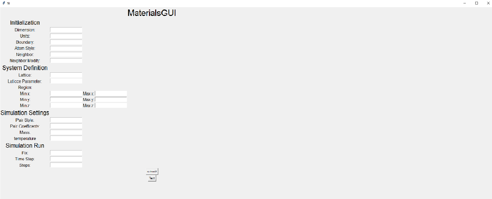
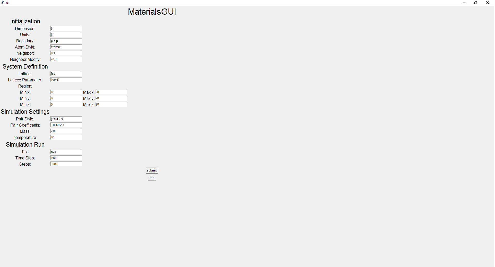

# GUINNERS DEV REPO

- ## Introduction
  
  
  
    In this Github repository We will find a simple GUI that's easy to use, that allows you to input the variables 
    needed to use LAMMPS and that creates a text file with them and then runs the next command in a terminal:
  
      lmp_serial -in in.sim
    
    Then the LAMMPS software executes a simulation of how the material would behave on those specific conditions. 

- ## Simple Example

  For this very simple example you will input the following values:
  
  - ##### Dimension: 3
  - ##### Units: lj
  - ##### Boundar: p p p
  - ##### Atom Style: atomic
  - ##### Neighbor: 0.3
  - ##### Neighbor Modify: 20,0
  - ##### Lattice: fcc
  - ##### Laticce Parameter: 0.8442
  - ##### Min x: 0
  - ##### Max x: 20
  - ##### Min y: 0
  - ##### Max y: 20
  - ##### Min z: 0
  - ##### Max z: 20
  - ##### Pair style: lj/cut 2.5
  - ##### Pair Coefficents: 1.0 1.0 2.5
  - ##### Mass: 2.0
  - ##### Temerature: 0.1
  - ##### Fix: nve
  - ##### Time Step: 0.01
  - ##### Steps: 1000
  
  It should look like this:

  

  And the output should be:

   (THIS IS HOW THE FILE SHALL BE NAMED)

  To corroborate that the software is working correctly you can use this example, and compare the output of this case 
with the output of the ***Test*** button. Both outputs should be the same.

- ## Requirements

  Since we haven't yet made the docker image of this app work, the user needs to have Python 3.8 (https://www.python.org/downloads/release/python-380/), Tkinter (https://docs.python.org/3/library/tkinter.html) and a LAMMPS serial executable (https://www.lammps.org/) installed.
  
  
- ## Demo
  We've uploaded a short video demonstration of the software in the video directory.
